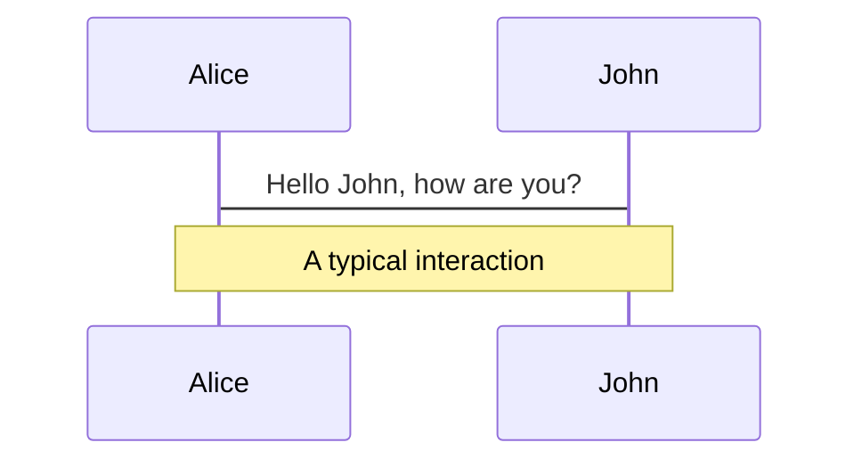
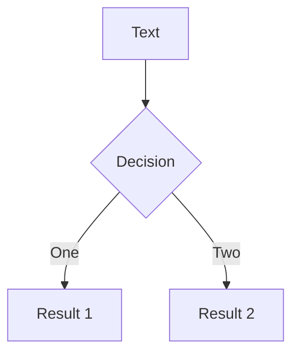

# 拥抱Vue3

探索前端新的开发体验改善

<!-- <div class="uppercase text-sm tracking-widest">
Chris-zhu
</div> -->

<div class="abs-bl mx-14 my-12 flex">
  
  <div class="ml-3 flex flex-col text-left">
    <div class="uppercase"><b>chris</b>zhu</div>
    <div class="text-sm opacity-50">Jul. 3th, 2021</div>
  </div>
</div>


---

## 一些数据

<div class="body" @click="$slidev.nav.next">
  <div class="left">
    <p><span class="data">1.58M</span> 周活跃用户（devtools插件统计）</p>
    <p><span class="data">9.4M</span> npm 月下载</p>
  </div>
  <div class="right" v-click>
    <p>去年同期对比</p>
    <p>Devtools <span class="data">1.1M -> 1.58M (</span> <span class="numAdd">+43.6%</span> <span>)</span></p>
    <p>NPM <span class="data">6.2M -> 9.4M (</span> <span class="numAdd">+51.6%</span> <span>)</span></p>
  </div>
</div>

<style>
.body{
  width:80%;
  position: fixed;
  top: 50%;
  left: 50%;
  transform: translate(-50%, -50%);
  display:flex;
  /* flex-direction: column; */
  justify-content: space-around;
  align-items: center;
}
.data{
  color: #46954A;
}
.numAdd{
  color: #E2B27D;
}
</style>

---

<devtools />

---

# Vue3 生态

<div class="body">
  <!-- vue3 -->
  <div @click="$slidev.nav.next" class="item vue3">
    
    <span>Vue3</span>
  </div>
  <!-- vite -->
  <div class="item vite" v-click="1">
    
    <span>Vite@v2</span>
  </div>
  <!-- vue-router@V4 -->
  <div class="item router" v-click="2">
    
    <span>Vue-Router@v4</span>
  </div>
  <!-- vuex@V4 -->
  <div class="item vuex" v-click="3">
    
    <span>Vuex@v4</span>
  </div>
  <!-- Typescript -->
  <div class="item js2ts" v-click="4">
    
    <span>Typescript</span>
  </div>
  <!-- UI库 -->
  <div class="item ui" v-click="5">
    <ul>
      <li>
        
        <span>Vant@V3</span>
      </li>
      <li>
        
        <span>Antd Vue@v2</span>
      </li>
      <li>
        
      </li>
      <li>
        
        <span>Naive</span>
      </li>
    </ul>
  </div>
  <!-- utils VueUse -->
  <div class="item vueuse" v-click="6">
    
    <span>VueUse</span>
  </div>
  <!-- Volar -->
  <div class="item volar" v-click="7">
    
    <span>Volar</span>
  </div>
</div>

<style>
.body{
  width:80%;
  height: 500px;
  position: fixed;
  top: 50%;
  left: 50%;
  transform: translate(-50%, -50%);
  display:flex;
  /* flex-direction: column; */
  justify-content: space-around;
  align-items: center;
}
.item{
  display:flex;
  flex-direction: column;
  align-items: center;
}
ul{
  list-style: none;
}
li{
  margin-top:10px;
  display: flex;
}
li span{
  margin-left: 6px;
}
.vite, .router, .vuex, .ui, .volar, .vueuse, .js2ts{
  position: absolute;
}
.vite{
  top: 28px;
  left: 177px;
}
.router{
  top: 153px;
  left: 40px;
}
.vuex{
  top: 312px;
  left: 143px;
}
.vueuse{
  top: 364px;
  left: 337px;
}
.ui{
  top: 309px;
  left: 555px;
}
.js2ts{
  top: 13px;
  left: 393px;
}
.volar{
  top: 94px;
  left: 616px;
}


</style>

---

# Vite

<vite />

---

<!-- <volar /> -->

# Type First 类型优先

<div grid="~ cols-2 gap-4">
<div>

- 类型提示
- 智能补全
- 省下写文档的时间
- 方便重构

</div>
<div>
  示例代码


</div>
</div>

---

# Composition Api (组合式Api)

<p @click="next">什么是组合式Api? 在vue3中引入的一种新的编写Vue组件的方式。</p>

<script setup lang="ts">
import {ref} from 'vue'
const step = ref(0)
const next = ()=>{
  if(step.value >= 5) return
  step.value += 1
}
</script>


<!-- step == 0 -->
<div v-if="step==0" grid="~ cols-2 gap-4">

```ts {all}
<script>
export default {
  data() {
    return {
      dark: false
    }
  },
  computed: {
    light(){
      return !this.dark
    }
  },
  methods: {
    toggle() {
      this.dark = !this.dark
    }
  }
}
</>
```


```ts {all}
<script>
import { ref, computed } from 'vue'
export default {
  setup () {
    const dark = ref(false)
    const light = computed(() => !dark.value)

    return {
      dark,
      light,
      toggle() {
        dark.value = !dark.value
      }
    }
  }
}
</script>
```

</div>

<!-- step == 1 -->
<div v-if="step==1" grid="~ cols-2 gap-4">

```ts {3,7,8,12,13,17}
<script>
export default {
  data() {
    return {
      dark: false
    }
  },
  computed: {
    light(){
      return !this.dark
    }
  },
  methods: {
    toggle() {
      this.dark = !this.dark
    }
  }
}
</script>
```


```ts {4,15}
<script>
import { ref, computed } from 'vue'
export default {
  setup () {
    const dark = ref(false)
    const light = computed(() => !dark.value)

    return {
      dark,
      light,
      toggle() {
        dark.value = !dark.value
      }
    }
  }
}
</script>
```

</div>

<!-- step == 2 -->
<div v-if="step==2" grid="~ cols-2 gap-4">

```ts {4-6}
<script>
export default {
  data() {
    return {
      dark: false
    }
  },
  computed: {
    light(){
      return !this.dark
    }
  },
  methods: {
    toggle() {
      this.dark = !this.dark
    }
  }
}
</script>
```


```ts {5,9}
<script>
import { ref, computed } from 'vue'
export default {
  setup () {
    const dark = ref(false)
    const light = computed(() => !dark.value)

    return {
      dark,
      light,
      toggle() {
        dark.value = !dark.value
      }
    }
  }
}
</script>
```

</div>

<!-- step == 3 -->
<div v-if="step==3" grid="~ cols-2 gap-4">

```ts {8-12}
<script>
export default {
  data() {
    return {
      dark: false
    }
  },
  computed: {
    light(){
      return !this.dark
    }
  },
  methods: {
    toggle() {
      this.dark = !this.dark
    }
  }
}
</script>
```


```ts {6,10}
<script>
import { ref, computed } from 'vue'
export default {
  setup () {
    const dark = ref(false)
    const light = computed(() => !dark.value)

    return {
      dark,
      light,
      toggle() {
        dark.value = !dark.value
      }
    }
  }
}
</script>
```

</div>

<!-- step == 4 -->
<div v-if="step==4" grid="~ cols-2 gap-4">

```ts {13-17}
<script>
export default {
  data() {
    return {
      dark: false
    }
  },
  computed: {
    light(){
      return !this.dark
    }
  },
  methods: {
    toggle() {
      this.dark = !this.dark
    }
  }
}
</script>
```


```ts {11-13}
<script>
import { ref, computed } from 'vue'
export default {
  setup () {
    const dark = ref(false)
    const light = computed(() => !dark.value)

    return {
      dark,
      light,
      toggle() {
        dark.value = !dark.value
      }
    }
  }
}
</script>
```

</div>

<!-- step == 5 -->
<div @click="$slidev.nav.next" v-if="step==5" grid="~ cols-2 gap-4">

```ts {all}
<script>
export default {
  data() {
    return {
      dark: false
    }
  },
  computed: {
    light(){
      return !this.dark
    }
  },
  methods: {
    toggle() {
      this.dark = !this.dark
    }
  }
}
</script>
```


```ts {all}
<script>
import { ref, computed } from 'vue'
export default {
  setup () {
    const dark = ref(false)
    const light = computed(() => !dark.value)

    return {
      dark,
      light,
      toggle() {
        dark.value = !dark.value
      }
    }
  }
}
</script>
```

</div>

---

<whyCompostion v-click="1"/>

<div v-click="2" grid="~ cols-2 gap-4">
  
<div>

对象式API存在的问题

<ul>
  <li v-click="3">不利于复用</li>
  <li v-click="4">潜在的命名冲突</li>
  <li v-click="5">上下文丢失</li>
  <li v-click="6">有限的类型支持</li>
  <li v-click="7">按API类型组织</li>
</ul>

</div>

<div>

组合式API提供的能力

<ul>
  <li v-click="3">极易复用（原生JS函数）</li>
  <li v-click="4">可灵活组合（生命周期钩子可多次使用）</li>
  <li v-click="5">提供更好的上下文支持</li>
  <li v-click="6">更好Typescript类型支持</li>
  <li v-click="7">按功能/逻辑组织</li>
  <li v-click="8">可独立与Vue组件使用</li>
</ul>

</div>

</div>

---

# 什么是组合式函数呢？

我认为它更像是可重用逻辑的集合，使代码更好地组织并分离关注点。

<dark />

```ts {all|2-3|5-15|all}
export function useDark(options: UseDarkOptions = {}) {
  const preferredDark = usePreferredDark()         // <--
  const store = useStorage('vueuse-dark', 'auto')  // <--

  return computed<boolean>({
    get() {
      return store.value === 'auto'
        ? preferredDark.value
        : store.value === 'dark'
    },
    set(v) {
      store.value = v === preferredDark.value 
        ? 'auto' : v ? 'dark' : 'light'
    },
  })
}
```


---

# 响应式原理

Use code snippets and get the highlighting directly!

<!-- https://sli.dev/guide/syntax.html#line-highlighting -->

```ts {monaco}
interface User {
  id: number
  firstName: string
  lastName: string
  role: string
}

function updateUser(id: number, update: User) {
  const user = getUser(id)
  const newUser = { ...user, ...update }
  saveUser(id, newUser)
}
```

<arrow v-click="3" x1="400" y1="420" x2="230" y2="330" color="red" width="3" arrowSize="1" />

---

# Components

<div grid="~ cols-2 gap-4">
  <div>

You can use Vue components directly inside your slides.

We have provided a few built-in components like `<Tweet/>` and `<Youtube/>` that you can use directly. And adding your custom components is also super easy.

```html
<Counter :count="10" />
```

  <!-- ./components/Counter.vue -->
  <Counter :count="10" m="t-4" />

Check out [the guides](https://sli.dev/builtin/components.html) for more.

  </div>
  <div>`  

```html
<Tweet id="1390115482657726468" />
```

  <Tweet id="1390115482657726468" scale="0.65" />

  </div>
</div>

---

## class: px-20

# Themes

Slidev comes with powerful theming support. Themes can provide styles, layouts, components, or even configurations for tools. Switching between themes by just **one edit** in your frontmatter:

<div grid="~ cols-2 gap-2" m="-t-2">

```yaml
---
theme: default
---
```

```yaml
---
theme: seriph
---
```


</div>

Read more about [How to use a theme](https://sli.dev/themes/use.html) and
check out the [Awesome Themes Gallery](https://sli.dev/themes/gallery.html).

---

## preload: false

# Animations

Animations are powered by [@vueuse/motion](https://motion.vueuse.org/).

```html
<div v-motion :initial="{ x: -80 }" :enter="{ x: 0 }">Slidev</div>
```

<div class="w-60 relative mt-6">
  <div class="relative w-40 h-40">
    
    
    
  </div>

  <div 
    class="text-5xl absolute top-14 left-40 text-[#2B90B6] -z-1"
    v-motion
    :initial="{ x: -80, opacity: 0}"
    :enter="{ x: 0, opacity: 1, transition: { delay: 2000, duration: 1000 } }">
    Slidev
  </div>
</div>

<!-- vue script setup scripts can be directly used in markdown, and will only affects current page -->
<script setup lang="ts">
const final = {
  x: 0,
  y: 0,
  rotate: 0,
  scale: 1,
  transition: {
    type: 'spring',
    damping: 10,
    stiffness: 20,
    mass: 2
  }
}
</script>

<div
  v-motion
  :initial="{ x:35, y: 40, opacity: 0}"
  :enter="{ y: 0, opacity: 1, transition: { delay: 3500 } }">

[Learn More](https://sli.dev/guide/animations.html#motion)

</div>

---

# LaTeX

LaTeX is supported out-of-box powered by [KaTeX](https://katex.org/).

<br>

Inline $\sqrt{3x-1}+(1+x)^2$

Block

$$
\begin{array}{c}

\nabla \times \vec{\mathbf{B}} -\, \frac1c\, \frac{\partial\vec{\mathbf{E}}}{\partial t} &
= \frac{4\pi}{c}\vec{\mathbf{j}}    \nabla \cdot \vec{\mathbf{E}} & = 4 \pi \rho \\

\nabla \times \vec{\mathbf{E}}\, +\, \frac1c\, \frac{\partial\vec{\mathbf{B}}}{\partial t} & = \vec{\mathbf{0}} \\

\nabla \cdot \vec{\mathbf{B}} & = 0

\end{array}
$$

<br>

[Learn more](https://sli.dev/guide/syntax#latex)

---

# Diagrams

You can create diagrams / graphs from textual descriptions, directly in your Markdown.

<div class="grid grid-cols-2 gap-4 pt-4 -mb-6">





</div>

[Learn More](https://sli.dev/guide/syntax.html#diagrams)

---

layout: center
class: text-center

---

# Learn More

[Documentations](https://sli.dev) / [GitHub Repo](https://github.com/slidevjs/slidev)
